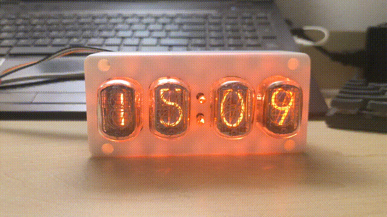
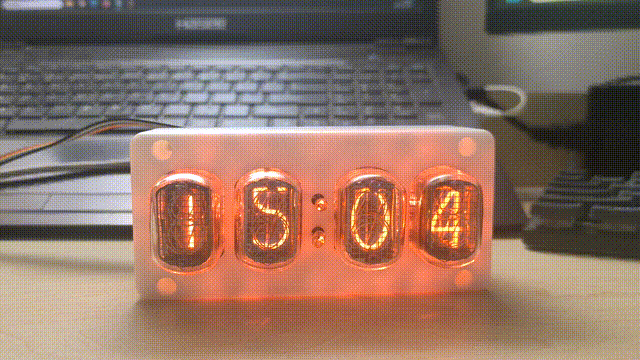
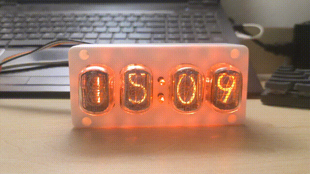
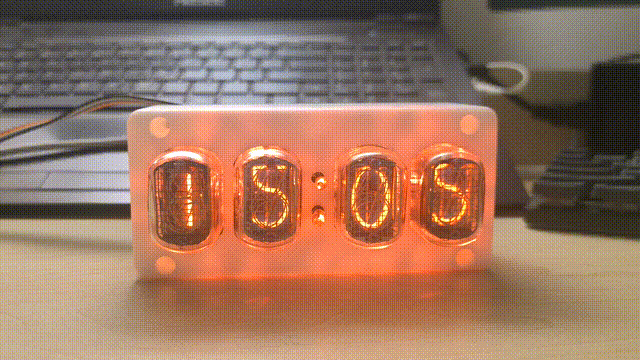
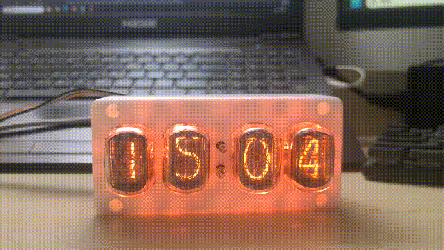
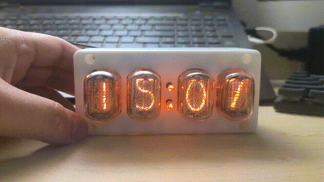
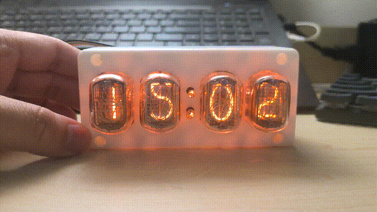
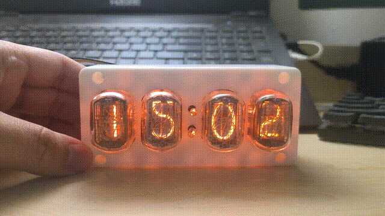
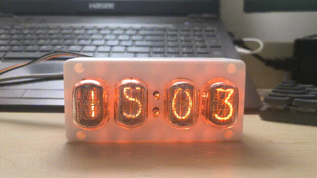
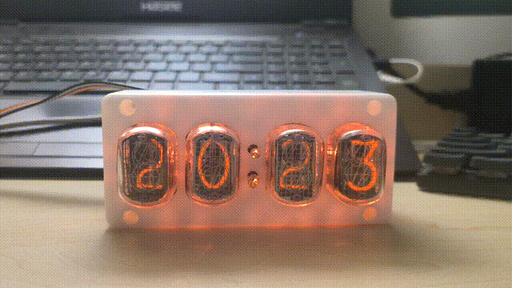

## 辉光管时钟固件

### 支持的功能

- [x] 时钟（月、日、时、分显示与设置，自动闰年）
- [x] 掉电时间不丢失
- [x] 丰富的效果
- [x] 一键关闭显示
- [x] 出厂测试模式

### 效果展示

|              | 常亮                                       | 呼吸                                 | 闪烁                                   |
| :----------- | :----------------------------------------- | :----------------------------------- | :------------------------------------- |
| LED          |    |    |    |
| 氖泡（引号） |  |  |  |

|            | 禁用                                               | 呼吸                                             | 呼吸（同时）                                                         | 跳动                                         |
| :--------- | :------------------------------------------------- | :----------------------------------------------- | :------------------------------------------------------------------- | :------------------------------------------- |
| 辉光管切换 |  |  |  |  |

|            | 常亮                                                    | 呼吸     | 闪烁                                             | 故障      |
| :--------- | :------------------------------------------------------ | :------- | :----------------------------------------------- | :-------- |
| 辉光管显示 |  | 图片暂缺 |  | 开发中... |

_辉光管切换效果中呼吸与呼吸（同时）仅兼容辉光管显示效果中的常亮_

### 使用说明

开机后进入时钟显示（时分），长按按键 4 进入设置模式。

| 模式     | 按键 1                                   | 按键 2                                     | 按键 3                                                                                           | 按键 4                     |
| :------- | :--------------------------------------- | :----------------------------------------- | :----------------------------------------------------------------------------------------------- | :------------------------- |
| 时钟显示 | 按下：切换月日显示 松开：切换时分显示 | 长按：进入工厂测试模式，测试完成后自动返回 | 按下：进入保护模式                                                                               | 长按：进入设置模式         |
| 时钟设置 | 按下：设置选项-1 长按：设置选项快速-1 | 按下：设置选项+1 长按：设置选项快速+1   | 按下：切换设置选项，顺序为年、月、日、时、分 切换完所有选项后退出设置模式并保存（默认秒为 0） | 按下：退出设置模式并不保存 |
| 保护     | 按下：返回时钟显示                       | 按下：返回时钟显示                         | 按下：返回时钟显示                                                                               | 按下：返回时钟显示         |

### 编译说明

支持 Keil MDK 5/IAR Embedded Workbench 8.40.2 及以上版本。

### 开发计划（自 2023-11-25 起）

- [x] 支持切换主题包
- [x] 支持看门狗
- [ ] 支持自动关闭显示
- [x] 支持不同版本的硬件切换编译
- [ ] 支持“故障”辉光管显示效果
- [x] 支持储存设置
- [x] 支持单片机内部 RTC
- [ ] 增加定时任务，支持定时同步时间
- [x] 优化 time_custom 部分的代码
- [x] 优化设置储存，延长内部Flash寿命

#### 已知问题

- [x] breath_meantime 效果在变换中途切换数字导致无法复位

### 许可

仅限用于个人非盈利用途。对于非盈利用途的个人可以使用、修改、复制和分发此代码，此代码可以被非盈利用途的个人私有化和闭源，只要包含版权声明、许可证条件和通知即可。禁止用于其他用途。
